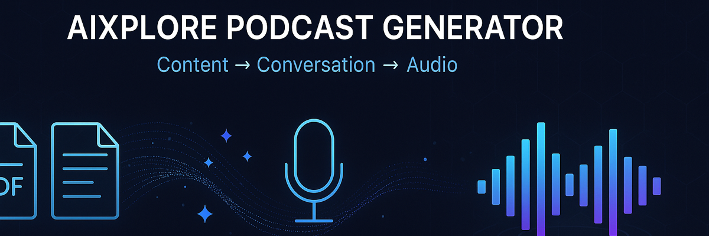

<p align="center">
  
</p>

<p align="center">
  <strong>Transform documents into engaging, NotebookLM-style podcast audio using Gemini AI.</strong>
</p>

<p align="center">
  <a href="#quick-start">Quick Start</a> •
  <a href="#tools">Tools</a> •
  <a href="#styles--voices">Styles & Voices</a> •
  <a href="#configuration">Configuration</a> •
  <a href="#examples">Examples</a> •
  <a href="LICENSE">License</a>
</p>

<p align="center">
  
  
  
  
</p>

---

## Overview

This MCP server takes any document — PDF, markdown, or plain text — and produces a natural-sounding podcast conversation. It runs a two-phase pipeline:

1. **Transcript Generation** — Gemini Flash/Pro creates a structured dialogue from your content, styled to your chosen format (scientific, casual chat, debate, etc.)
2. **Audio Synthesis** — Gemini TTS renders the dialogue with distinct speaker voices into a WAV file

You can run both phases end-to-end, or generate the transcript first, review/edit it, then synthesize audio separately.

## Architecture

```
┌─────────────┐     ┌──────────────────┐     ┌─────────────────┐
│ Input File   │────▶│ Content Extractor │────▶│ Transcript Gen  │
│ (PDF/MD/TXT) │     │ (pypdf / read)   │     │ (Gemini Flash)  │
└─────────────┘     └──────────────────┘     └────────┬────────┘
                                                       │
                                              JSON dialogue
                                                       │
                                                       ▼
                                             ┌─────────────────┐
                                             │ Audio Synthesizer│
                                             │ (Gemini TTS)     │
                                             └────────┬────────┘
                                                       │
                                                  WAV audio
                                                       │
                                                       ▼
                                             ┌─────────────────┐
                                             │ Output File      │
                                             │ (podcast_*.wav)  │
                                             └─────────────────┘
```

## Quick Start

### Prerequisites

- Python 3.10+
- A Gemini API key (direct or via Azure AI Gateway)

### Install

```bash
cd podcast-mcp
uv pip install -e .
# or without uv: pip install -e .
```

### Configure

Create a `.env` file or export environment variables:

```env
# Required
GEMINI_API_KEY=your-api-key-here
GEMINI_BASE_URL=https://your-gateway.example.com/v1beta

# Optional — Show defaults
PODCAST_SHOW_NAME=AIXplore
PODCAST_HOST_NAME=Alex
PODCAST_GUEST_NAME=Dr. Chen
PODCAST_HOST_VOICE=Kore
PODCAST_GUEST_VOICE=Puck

# Optional — Style defaults
PODCAST_DEFAULT_STYLE=topic_explainer
PODCAST_DEFAULT_AUDIENCE=technical
PODCAST_DEFAULT_LENGTH=medium

# Optional — Models
GEMINI_TRANSCRIPT_MODEL=gemini-2.5-flash
GEMINI_TTS_MODEL=gemini-2.5-flash-preview-tts
```

### Add to Claude Code

```json
{
  "mcpServers": {
    "podcast": {
      "command": "uv",
      "args": ["run", "--directory", "/path/to/podcast-mcp", "podcast-mcp"],
      "env": {
        "GEMINI_API_KEY": "your-key",
        "GEMINI_BASE_URL": "https://your-gateway/v1beta"
      }
    }
  }
}
```

Or without `uv`:

```json
{
  "mcpServers": {
    "podcast": {
      "command": "python",
      "args": ["-m", "podcast_mcp"],
      "cwd": "/path/to/podcast-mcp",
      "env": {
        "GEMINI_API_KEY": "your-key",
        "GEMINI_BASE_URL": "https://your-gateway/v1beta"
      }
    }
  }
}
```

## Tools

### `podcast_generate_transcript`

Generate a dialogue transcript from content. Returns JSON you can review and edit before synthesis.

| Parameter | Type | Default | Description |
|-----------|------|---------|-------------|
| `content` | string | — | Source text (provide this OR `file_path`) |
| `file_path` | string | — | Path to `.pdf`, `.md`, or `.txt` file |
| `style` | enum | `topic_explainer` | Podcast style (see below) |
| `audience` | enum | `technical` | Audience level |
| `length` | enum | `medium` | Duration target |
| `speaker_mode` | enum | `multi` | `single` or `multi` speaker |
| `show_name` | string | `AIXplore` | Show name |
| `host_name` | string | `Host` | Host speaker name |
| `guest_name` | string | `Guest` | Guest speaker name |

### `podcast_synthesize_audio`

Convert a transcript to audio. Takes the JSON output from `podcast_generate_transcript`.

| Parameter | Type | Default | Description |
|-----------|------|---------|-------------|
| `transcript` | array | *(required)* | Array of `{speaker, line}` objects |
| `speaker_mode` | enum | `multi` | `single` or `multi` |
| `host_name` | string | `Host` | Must match transcript speakers |
| `guest_name` | string | `Guest` | Must match transcript speakers |
| `host_voice` | enum | `Kore` | Gemini voice for host |
| `guest_voice` | enum | `Puck` | Gemini voice for guest |
| `output_path` | string | auto | Output WAV file path |

### `podcast_create`

End-to-end: content → transcript → audio in one call. Accepts all parameters from both tools above.

## Styles & Voices

### Podcast Styles

| Style | Description |
|-------|-------------|
| `scientific` | Research-focused with methodology and findings |
| `technical_deep_dive` | Implementation details and architectural trade-offs |
| `topic_explainer` | Makes complex topics accessible with analogies |
| `interview` | Conversational with personal experiences and opinions |
| `news_briefing` | Concise analysis of recent developments |
| `casual_chat` | Two friends chatting — light humor, natural tangents |
| `debate` | Structured contrasting perspectives |
| `storytelling` | Narrative arc with setup, tension, resolution |

### Audience Levels

| Level | Description |
|-------|-------------|
| `general` | No jargon, first-principles explanations |
| `technical` | Industry terminology okay, focus on how/why |
| `expert` | Skip basics, dive into nuance and trade-offs |
| `executive` | Strategic implications, ROI, actionable insights |

### Available Voices

| Voice | Gender | Character |
|-------|--------|-----------|
| `Puck` | Male | Conversational, friendly |
| `Charon` | Male | Deep, authoritative |
| `Fenrir` | Male | Energetic, dynamic |
| `Orus` | Male | Calm, measured |
| `Kore` | Female | Neutral, professional |
| `Aoede` | Female | Warm, melodic |
| `Leda` | Female | Clear, articulate |
| `Zephyr` | Female | Light, upbeat |

## Examples

**Create a podcast from a PDF:**
```
Create a podcast from /path/to/paper.pdf
```

**AIXplore episode with configured speakers:**
```
Create an AIXplore episode about this document.
Use Alex as host and Dr. Chen as guest.
Style: technical deep-dive, audience: technical, length: medium.
```

**Review transcript before synthesis:**
```
Step 1: Generate a transcript from this markdown content, scientific style
Step 2: [Review and optionally edit the transcript]
Step 3: Synthesize the audio with Charon for host and Aoede for guest
```

**Single-speaker briefing:**
```
Create a short news briefing podcast from this article.
Single speaker, executive audience.
```

## End-to-End Test

```bash
export GEMINI_API_KEY="your-key"

# Quick test with defaults
python test_e2e.py

# Custom style & length
python test_e2e.py --style scientific --length medium

# Single speaker monologue
python test_e2e.py --mode single --style news_briefing --length short

# Transcript only (skip audio)
python test_e2e.py --transcript-only

# Full customization
python test_e2e.py --style debate --audience expert --length long \
    --host "Ronen" --guest "Dr. Smith" \
    --host-voice Charon --guest-voice Aoede \
    --show "AIXplore Deep Dive"
```

## Troubleshooting

| Error | Fix |
|-------|-----|
| `GEMINI_API_KEY is not set` | Set via environment variable or `.env` file |
| `Failed to parse transcript response` | Try `gemini-2.5-flash` or `gemini-2.5-pro` for `GEMINI_TRANSCRIPT_MODEL` |
| `No inlineData found in response` | Verify `GEMINI_TTS_MODEL` and `GEMINI_BASE_URL` are correct for your region |
| Audio sounds choppy | Long transcripts are chunked for TTS. Try shorter content or manual transcript editing |

## License

[MIT](LICENSE)
